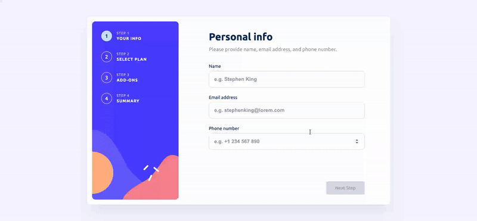

<h1 align="center">
    Multi Step Form
</h1>



<p align="center">
  
  <br />
  
  <br />
    
</p>

<p align="center">
    <a href="https://multi-step-form-pi-flame.vercel.app/" target="_blank">Click here to see the live demo!</a>&nbsp;&nbsp;&nbsp;
</p>

## Description
An application made in **React and TypeScript** that represents a form for filling in user data and selecting plans with price changes. The user will be able to navigate through the application and ensure that their data is not lost if they decide to make changes to plans or select add ons.

## User stories
- User can fill the inputs to enable navigation;
- User can't navigate if the form is not filled;
- User can go back or forward in navigation with the data storaged in localStorage;
- User can switch between plan and add ons options anytime before order is placed;

## How to install:

- git clone: https://github.com/kdumagalhaes/multi-step-form.git

```
npm install
```
```
npm run dev
```
## Requirements:
- Node's latest version installed on your machine.
- https://nodejs.org/en/download/

## Technologies

- [ReactJS](https://reactjs.org/)
- [Vite](https://vitejs.dev/)
- [TypeScript](https://www.typescriptlang.org/)
- [Redux Toolkit](https://redux-toolkit.js.org/)
- [Module SCSS](https://github.com/css-modules/css-modules)
- [React Router](https://reactrouter.com/en/main)
- [React Confetti](https://www.npmjs.com/package/react-confetti)
- [Husky](https://www.npmjs.com/package/husky)


Made by [Carlos](https://www.linkedin.com/in/kdumagalhaes/) :wave:
